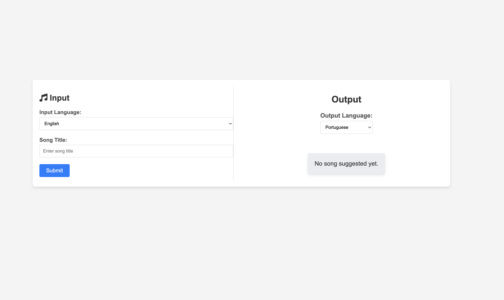

### August 23, 2024

* Explored potential data sources and chose [Genius Song Lyrics](https://www.kaggle.com/datasets/carlosgdcj/genius-song-lyrics-with-language-information)
* Created a initial template on how the app may look like. 
* Started exploration of the data
* Next session, I intend to work on title search -- How to show potential songs as the user is typing the song title. Open to both using an existing tool and building a new one myself.  